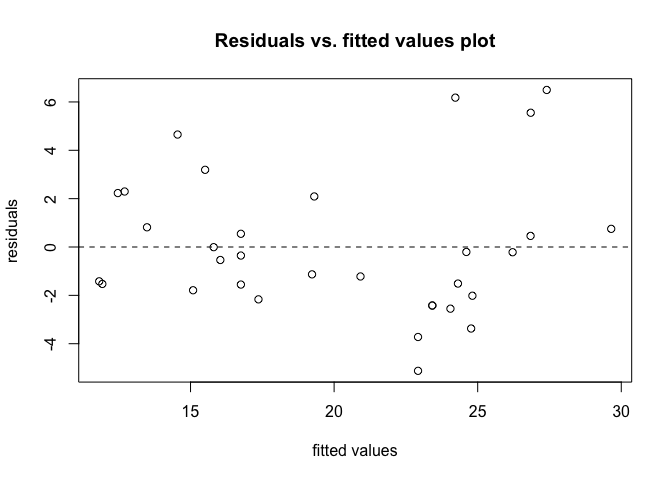
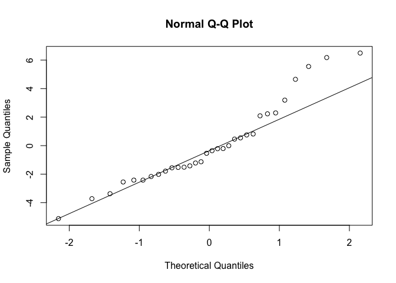
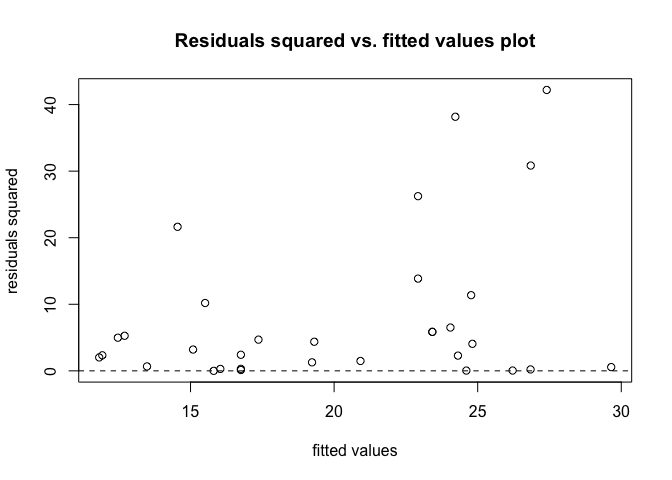

<!-- README.md is generated from README.Rmd. Please edit that file -->

# hw3biostat625

<!-- badges: start -->

[](https://github.com/jianxion/hw3biostat625/actions/workflows/R-CMD-check.yaml)
[](https://app.codecov.io/gh/jianxion/hw3biostat625?branch=master)
<!-- badges: end -->

## Overview

Since this is just a practice for creating a r package, this package
only contains one function called `my.lm()`. This function helps you to
fit a simple or multiple linear regression on a dataset. The output will
contain a table of coefficients, calculated R-squared and ajusted
R-squared value, F statistic with degree of freedoms. These outputs are
the same as R built-in summary.lm() function gives you, but the
`my.lm()` function’s output will also contain three plots to help you
check the assumptions of “LINE”” of a linear regression model.

## Installation

You can install the development version of hw3biostat625 from
[GitHub](https://github.com/) with:

``` r
# install.packages("devtools")
devtools::install_github("jianxion/hw3biostat625")
```

## Example

This is a basic example which shows you how to solve a common problem:

``` r
library(hw3biostat625)
## basic example code
```

Here is an example of fitting a multiple linear regression model on the
mtcars dataset. The target variable is mpg and the predictors are disp,
hp, and drat.

``` r
x = mtcars[, c(3,4,5)]
y = mtcars$mpg
mymodel <- my.lm(x, y)
#> [1] "The model estimated coefficients and standard deviations, t values and p values:"
#>                Estimate  Std. Error   t value    Pr(>|t|)
#> (Intercept) 19.34429256 6.370882214  3.036360 0.005133133
#> disp        -0.01923223 0.009371402 -2.052225 0.049602794
#> hp          -0.03122932 0.013344973 -2.340156 0.026630980
#> drat         2.71497521 1.487366167  1.825358 0.078632122
```



    #> [1] "R-squared value is"
    #> [1] 0.7750131
    #> [1] "F statistic is"
    #> [1] 32.15056
    #> [1] "With degrees of freedom on df1:"
    #> [1] 3
    #> [1] "And df2:"
    #> [1] 28
    #> [1] "Adjusted R-squared value is"
    #> [1] 0.7509073
